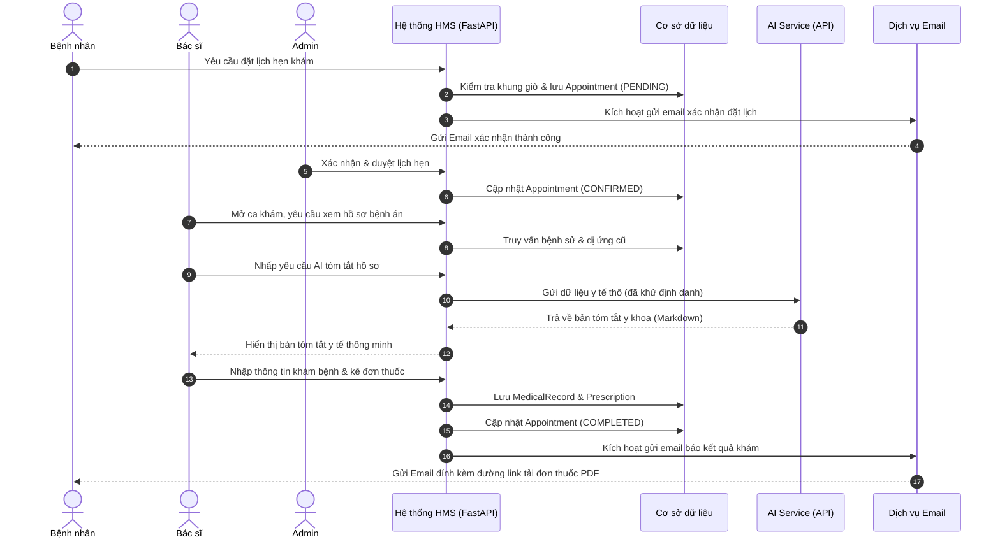
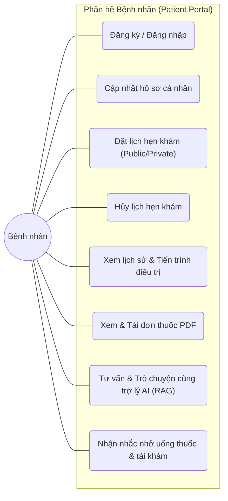
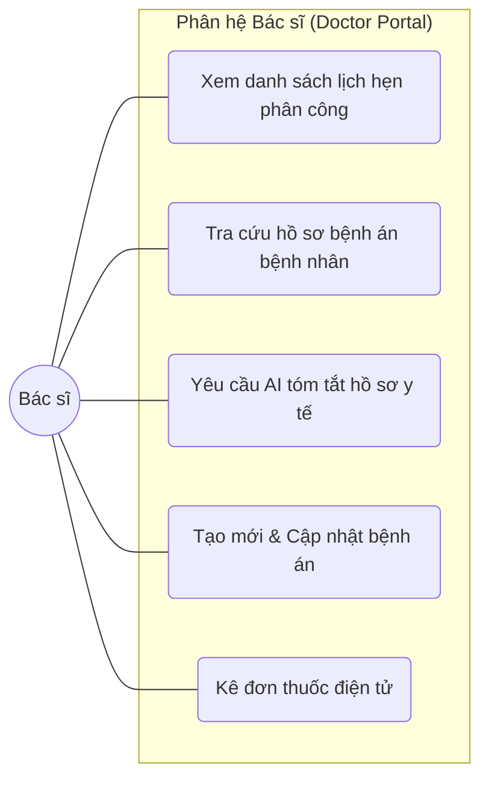

# TÀI LIỆU SRS DỰ ÁN QUẢN LÝ HỒ SƠ Y TẾ ĐIỆN TỬ VÀ ĐẶT LỊCH KHÁM (EMR)

## 1. Giới thiệu (Introduction)

### 1.1. Mục đích (Purpose)
Mục đích của hệ thống quản lý hồ sơ y tế điện tử và đặt lịch khám (EMR & Booking System) là:
* Tin học hóa quy trình quản lý hồ sơ y tế nhằm giảm bớt việc ghi chép thủ công, tăng hiệu quả và độ chính xác trong lưu trữ dữ liệu bệnh án.
* Hỗ trợ quản lý thông tin người dùng bao gồm: bệnh nhân, bác sĩ, nhân viên quản trị hệ thống.
* Quản lý hồ sơ bệnh án (medical records), tiền sử bệnh nhân, dị ứng thuốc, đơn thuốc điện tử, lịch hẹn khám một cách tập trung, dễ dàng tra cứu.
* Đảm bảo an toàn và bảo mật dữ liệu thông qua cơ chế phân quyền người dùng (Role & Permission), kiểm soát truy cập và lưu vết hành động (Audit log).
* Hỗ trợ công tác khám chữa bệnh bằng cách cung cấp cho bác sĩ thông tin bệnh án đầy đủ, chính xác, nhanh chóng và tích hợp trợ lý AI phân tích, tóm tắt.
* Nâng cao trải nghiệm cho bệnh nhân khi có thể chủ động đăng ký, đặt lịch hẹn khám trực tuyến và tra cứu đơn thuốc, lịch sử điều trị từ xa.
* Tối ưu vận hành cơ sở y tế thông qua việc điều phối lịch hẹn bác sĩ, quản lý danh mục chuyên khoa và báo cáo thống kê phục vụ quản trị.

### 1.2. Phạm vi hệ thống (System scope)
Hệ thống quản lý hồ sơ y tế điện tử và đặt lịch khám (EMR) được thiết kế để bao quát toàn bộ hoạt động đặt lịch, chẩn đoán lâm sàng và quản lý hồ sơ y khoa:
Các chức năng chính trong phạm vi hệ thống:
* **Quản lý người dùng & phân quyền:**
  * Tạo tài khoản cho bệnh nhân, bác sĩ, quản trị viên (Admin)
  * Quản lý vai trò (Role) và quyền hạn (Permission)
  * Đăng nhập, đăng xuất, kiểm soát truy cập và bảo mật dữ liệu
* **Quản lý bệnh nhân:**
  * Lưu trữ thông tin cá nhân và hồ sơ bệnh nhân điện tử (Patient Profile)
  * Quản lý tiền sử bệnh lý, dị ứng thuốc của bệnh nhân
  * Quản lý lịch sử khám bệnh, tiến trình điều trị
* **Quản lý lịch hẹn khám:**
  * Đặt và quản lý lịch hẹn khám (cho cả bệnh nhân đã đăng nhập và đặt lịch public)
  * Quản lý trạng thái lịch hẹn (PENDING, CONFIRMED, COMPLETED, CANCELLED)
  * Hủy lịch hẹn trực tuyến theo thời gian quy định
* **Quản lý hồ sơ bệnh án & Đơn thuốc:**
  * Tạo mới và cập nhật hồ sơ bệnh án (Triệu chứng, Chẩn đoán, Hướng điều trị, Ghi chú)
  * Kê đơn thuốc điện tử chi tiết (Tên thuốc, liều lượng, số lượng, hướng dẫn sử dụng)
  * Xem chi tiết, in ấn và tải xuống đơn thuốc định dạng PDF
* **AI hỗ trợ tóm tắt bệnh án:**
  * Thu thập dữ liệu bệnh án cũ, tiền sử, đơn thuốc hiện tại gửi đến AI Service
  * Hiển thị bản tóm tắt y tế có cấu trúc cho bác sĩ
  * Cho phép sao chép/chèn nội dung tóm tắt vào ghi chú khám bệnh
* **Quản trị hệ thống & Báo cáo:**
  * Theo dõi hoạt động người dùng (Audit log)
  * Quản lý danh mục chuyên khoa và danh mục thuốc cơ bản
  * Xem danh sách bác sĩ, gán bác sĩ vào chuyên khoa và cập nhật thông tin bác sĩ

**Ngoài phạm vi hệ thống (Out of Scope):**
* Tích hợp trực tiếp với hệ thống quản lý bảo hiểm quốc gia
* Hệ thống chẩn đoán tự động thay thế quyết định chuyên môn của bác sĩ (AI chỉ hỗ trợ tóm tắt)
* Quản lý kho thuốc, nhập - xuất - tồn kho chi tiết và nhà cung cấp thuốc
* Cổng thanh toán viện phí trực tuyến và đối soát tài chính

### 1.3. Mục tiêu hệ thống (System objective)
Mục tiêu của hệ thống quản lý hồ sơ y tế điện tử (EMR) là xây dựng một giải pháp tập trung, chính xác, an toàn và dễ sử dụng nhằm hỗ trợ quản lý toàn bộ hoạt động đặt lịch, khám bệnh và lưu trữ bệnh sử:
Các mục tiêu chính:
* **Tập trung hóa dữ liệu y tế:** Lưu trữ toàn bộ thông tin bệnh nhân, hồ sơ bệnh án, lịch sử điều trị và đơn thuốc trong một hệ thống duy nhất. Giúp giảm tình trạng trùng lặp hoặc thất lạc hồ sơ y tế giấy.
* **Tăng hiệu quả quản lý và vận hành:** Quản lý chuyên khoa, lịch hẹn và bác sĩ một cách minh bạch. Tự động hóa quy trình đặt lịch trực tuyến, gửi email xác nhận và nhắc hẹn tự động.
* **Hỗ trợ bác sĩ trong chẩn đoán và điều trị:** Cung cấp đầy đủ hồ sơ bệnh sử, tiền sử bệnh và dị ứng thuốc của bệnh nhân. Tích hợp trợ lý AI giúp bác sĩ tóm tắt nhanh bệnh án của các ca bệnh phức tạp.
* **Nâng cao trải nghiệm bệnh nhân:** Cho phép bệnh nhân đặt lịch khám trực tuyến từ xa, theo dõi tiến trình điều trị và tái khám. Chủ động tra cứu, in ấn và tải xuống đơn thuốc PDF khi cần thiết.
* **Đảm bảo an toàn và bảo mật dữ liệu:** Quản lý phân quyền người dùng (Role & Permission) nghiêm ngặt. Theo dõi hoạt động hệ thống bằng audit log và session management. Bảo mật thông tin cá nhân và dữ liệu y tế theo quy định an toàn thông tin.

---

## 2. Mô tả tổng quan về dự án (System Overview)

### 2.1. Kiến trúc hệ thống (System architecture)
Hệ thống quản lý hồ sơ y tế điện tử (EMR) được phát triển theo kiến trúc phân lớp (Layered Architecture) kết hợp mô hình client–server. Backend sử dụng FastAPI (Python) làm framework chính để triển khai dịch vụ, frontend sử dụng Next.js/TailwindCSS để xây dựng giao diện người dùng tối ưu, dữ liệu lưu trữ trên RDBMS (MySQL/PostgreSQL) và Object Storage (AWS S3).

Hệ thống được chia thành 3 tầng chính:
1. **Presentation Layer (Frontend/UI):**
   * Cung cấp giao diện web cho bệnh nhân, bác sĩ và quản trị viên (Admin)
   * Tương tác với backend thông qua RESTful API
   * Hiển thị các chức năng như: đặt lịch khám, quản lý hồ sơ bệnh án, xem đơn thuốc, tóm tắt AI
2. **Application Layer (Backend – FastAPI):**
   * FastAPI chịu trách nhiệm xử lý toàn bộ nghiệp vụ
   * Tổ chức theo cấu trúc phân lớp APIRouter – Service – CRUD/Repository kết hợp Dependency Injection của FastAPI
   * Router/Endpoint: nhận request từ frontend, validate dữ liệu đầu vào thông qua các Pydantic Schemas
   * Service: xử lý logic nghiệp vụ (ví dụ: tạo lịch hẹn, lưu bệnh án, kê đơn thuốc, kết nối AI API)
   * CRUD/Repository: giao tiếp với database thông qua SQLAlchemy hoặc SQLModel ORM
   * Tích hợp bảo mật bằng FastAPI Depends (OAuth2 + JWT Bearer / python-jose) (Authentication & Authorization)
   * Hỗ trợ ghi log hoạt động quan trọng thông qua FastAPI Middlewares, Background Tasks và Custom Dependencies
3. **Data Layer (Database & Storage):**
   * Sử dụng MySQL/PostgreSQL để lưu trữ dữ liệu quan hệ (users, patients, doctors, appointments, medical_records, prescriptions...)
   * Dữ liệu tệp tin (PDF đơn thuốc, kết quả đính kèm) được lưu trữ trên Object Storage (AWS S3)
   * Quản lý quan hệ dữ liệu chặt chẽ bằng khóa ngoại (FK) và ràng buộc (Constraints)

#### 2.1.1. Kiến trúc chi tiết trong FastAPI
* **Thành phần & Thư viện Python:**
  * `fastapi` & `uvicorn`: xây dựng và chạy REST API bất đồng bộ (async/await)
  * `sqlalchemy` hoặc `sqlmodel` (kết hợp `alembic` để migration): ORM kết nối database
  * `pydantic`: định nghĩa schemas, tự động validate và serialize/deserialize dữ liệu
  * `python-jose` (hoặc `pyjwt`) & `passlib` (với `bcrypt`): xác thực JWT, mã hóa mật khẩu
  * `fastapi-mail` hoặc `aiosmtplib`: tích hợp gửi email tự động bất đồng bộ
  * FastAPI Middleware & Custom Dependencies: ghi lại hoạt động (audit log) và phân quyền
* **Luồng xử lý điển hình:**
  1. Bệnh nhân/Bác sĩ gửi request từ frontend -> REST API
  2. FastAPI Routers tiếp nhận request, tự động validate qua Pydantic Schemas, xác thực quyền truy cập qua Security Dependencies (OAuth2 / JWT Bearer) -> gọi Endpoint handler
  3. Service xử lý logic nghiệp vụ, gọi dịch vụ ngoài (AI API/Email Service) nếu cần, và tương tác với SQLAlchemy/SQLModel Database Session (CRUD Layer)
  4. CRUD truy vấn cơ sở dữ liệu
  5. Kết quả trả về qua Service -> Endpoint handler tự động serialize dữ liệu qua Pydantic Response Model -> Response JSON/File cho frontend

#### 2.1.2. Kiến trúc triển khai (Deployment Architecture)
* **Môi trường triển khai:**
  * **Dev & Test:** chạy trên máy cục bộ hoặc môi trường Docker Container
  * **Production:** triển khai trên dịch vụ Cloud (AWS/Azure/GCP)
* **Các thành phần chính khi deploy:**
  * **Load Balancer:** phân phối tải giữa nhiều instance ứng dụng
  * **FastAPI App:** backend Python (Uvicorn/Gunicorn) xử lý nghiệp vụ chạy dưới dạng các containerized instances
  * **Database Server:** MySQL/Postgres cluster hỗ trợ backup định kỳ
  * **Object Storage:** AWS S3 lưu trữ tài liệu đơn thuốc PDF
  * **File System/Cloud Storage:** lưu log hệ thống

### 2.2. Các yếu tố bên ngoài tác động đến hệ thống (External factors affecting the system)
Hệ thống quản lý hồ sơ y tế điện tử (EMR) không hoạt động độc lập mà chịu sự tác động từ nhiều yếu tố bên ngoài, bao gồm:

* **Yếu tố con người (Human Factors):**
  * **Bệnh nhân (Patients):** sử dụng hệ thống để đặt lịch khám trực tuyến, cập nhật thông tin hồ sơ sức khỏe cá nhân, xem và tải đơn thuốc.
  * **Bác sĩ (Doctors):** nhập liệu triệu chứng, chẩn đoán, kê đơn thuốc, xem bệnh án cũ và sử dụng trợ lý AI tóm tắt thông tin bệnh án để hỗ trợ khám bệnh.
  * **Quản trị viên (Admin):** quản lý tài khoản người dùng, phân quyền chi tiết, giám sát hoạt động hệ thống, thêm mới bác sĩ và gán chuyên khoa.
* **Yếu tố tổ chức & pháp lý (Organizational & Legal Factors):**
  * **Quy chuẩn lưu trữ hồ sơ y tế:** tuân thủ các quy chuẩn pháp luật về bảo mật thông tin bệnh án và thời gian lưu giữ hồ sơ bệnh nhân.
  * **Luật An toàn thông tin:** đảm bảo dữ liệu sức khỏe của bệnh nhân không bị rò rỉ, chỉ được truy cập bởi bác sĩ điều trị và người có thẩm quyền.
  * **Quy trình chuyên môn:** hệ thống cần tương thích chặt chẽ với quy trình khám chữa bệnh tại phòng khám (Tiếp nhận -> Khám lâm sàng -> Chẩn đoán & Kê đơn).
* **Yếu tố công nghệ (Technological Factors):**
  * **Kết nối mạng:** tốc độ internet của người dùng ảnh hưởng đến trải nghiệm đặt lịch và tải dữ liệu bệnh án.
  * **Tích hợp API dịch vụ ngoài:** phụ thuộc vào tính ổn định và bảo mật của AI API (OpenAI/Gemini) và Email Provider (SendGrid/Amazon SES).
  * **An toàn hệ thống:** yêu cầu sử dụng chứng chỉ SSL/TLS, mã hóa dữ liệu nhạy cảm và cơ chế tự động ghi log lỗi.
* **Yếu tố kinh tế (Economic Factors):**
  * Chi phí triển khai ban đầu (thiết kế, lập trình, hạ tầng cloud).
  * Chi phí vận hành định kỳ (duy trì server, phí gọi API dịch vụ AI, dịch vụ email).
  * Lợi ích kinh tế thu lại nhờ giảm thiểu chi phí in ấn hồ sơ giấy và nâng cao tốc độ khám chữa bệnh của bác sĩ.
* **Yếu tố môi trường & xã hội (Environmental & Social Factors):**
  * **Xu hướng số hóa dịch vụ y tế:** nhu cầu của xã hội về việc tiếp cận dịch vụ y khoa trực tuyến nhanh chóng, minh bạch.
  * **Giảm thiểu rác thải giấy:** đóng góp vào bảo vệ môi trường nhờ hồ sơ bệnh án điện tử và đơn thuốc PDF.

---

## 3. Yêu cầu chức năng (Functional Requirements)

### 3.1. Chức năng không cần xác thực (Functional Without authentication)
* **Tổng quan:** Nhóm chức năng dành cho khách vãng lai hoặc bệnh nhân chưa thực hiện đăng nhập vào hệ thống.
* **Chức năng:**
  * **Trang chủ & Tra cứu thông tin:**
    * Xem thông tin giới thiệu chung về cơ sở y tế.
    * Tra cứu danh sách chuyên khoa của phòng khám.
    * Tra cứu danh sách bác sĩ (họ tên, học vị, chuyên khoa, lịch khám).
    * Xem thông tin liên hệ (địa chỉ, số điện thoại, email hỗ trợ).
  * **Đặt lịch khám công khai (Public Booking):**
    * Cho phép khách đặt lịch khám trực tuyến bằng cách nhập thông tin cá nhân bắt buộc (Họ tên, Email, Số điện thoại, Ngày sinh, Giới tính).
    * Chọn chuyên khoa khám, bác sĩ khám mong muốn (tùy chọn), ngày khám và khung giờ khám còn trống.
    * Nhập thông tin ban đầu: lý do khám/triệu chứng (bắt buộc), tiền sử bệnh án và dị ứng thuốc (tùy chọn).
    * Hệ thống tự động kiểm tra tính hợp lệ của dữ liệu đầu vào và tính khả dụng của khung giờ khám.
  * **Xác nhận lịch hẹn:**
    * Tự động gửi email xác nhận đặt lịch thành công chứa mã lịch hẹn và chi tiết thông tin cuộc hẹn cho khách.
    * Hiển thị thông báo thành công trên màn hình đặt lịch.
  * **Tư vấn và giải đáp quy trình qua Trợ lý AI (RAG & LangChain):**
    * Trò chuyện trực tiếp với trợ lý AI tại khung chat công khai của phòng khám.
    * Nhận tư vấn định hướng chuyên khoa khám phù hợp dựa trên mô tả triệu chứng sức khỏe lâm sàng ban đầu.
    * Giải đáp các thắc mắc về quy trình, thủ tục hành chính tại cơ sở y tế (như BHYT, quy trình đăng ký tiếp đón...).

🡪 Tóm lại: Các chức năng không cần xác thực tập trung vào tra cứu thông tin cơ bản và đặt lịch khám trực tuyến nhanh chóng đối với khách chưa có tài khoản.

### 3.2. Chức năng dành cho bệnh nhân (Functional For Patient)
* **Tổng quan:** Nhóm chức năng dành cho người bệnh đã đăng ký và đăng nhập vào hệ thống để tự quản lý sức khỏe.
* **Chức năng:**
  * **Quản lý tài khoản & Hồ sơ cá nhân:**
    * Đăng ký tài khoản (xác thực OTP qua email) và đăng nhập/đăng xuất hệ thống.
    * Cập nhật chi tiết hồ sơ bệnh nhân (Patient Profile): địa chỉ, nghề nghiệp, thông tin liên hệ khẩn cấp, tiền sử bệnh lý cá nhân và dị ứng thuốc đã biết.
  * **Đặt lịch hẹn khám nhanh:**
    * Đặt lịch khám trực tuyến với thông tin cá nhân được tự động điền từ hồ sơ hệ thống.
    * Chọn chuyên khoa, bác sĩ, ngày và khung giờ trống. Nhập triệu chứng hiện tại và gửi yêu cầu.
  * **Quản lý & Hủy lịch hẹn:**
    * Xem danh sách các lịch hẹn đã đặt kèm trạng thái (PENDING, CONFIRMED, CANCELLED).
    * Hủy lịch hẹn trực tuyến đối với các lịch khám ở trạng thái PENDING hoặc CONFIRMED trước giờ khám tối thiểu **2 giờ**, kèm theo lý do hủy lịch.
  * **Tra cứu lịch sử khám & Tiến trình điều trị:**
    * Xem danh sách lịch sử tất cả các lần khám bệnh trong quá khứ (ngày khám, bác sĩ phụ trách, chuyên khoa, chẩn đoán chính).
    * Xem chi tiết tiến trình điều trị của một đợt khám cụ thể (hướng điều trị, ghi chú tái khám từ bác sĩ).
  * **Xem & Tải đơn thuốc điện tử:**
    * Xem chi tiết các đơn thuốc được kê tương ứng với từng lần khám.
    * Tải xuống đơn thuốc dưới định dạng PDF hoặc gửi lệnh in trực tiếp từ thiết bị.
  * **Tư vấn và trò chuyện cùng trợ lý AI (RAG & LangChain):**
    * Cho phép bệnh nhân đã đăng nhập trò chuyện với Trợ lý AI để nhận tư vấn sức khỏe, định hướng chuyên khoa và hỏi đáp quy trình dịch vụ.
  * **Nhận thông báo và nhắc nhở sau khám (Post-examination Reminders):**
    * Nhận các thông báo tự động (qua email/hệ thống) nhắc lịch uống thuốc đúng giờ theo đơn thuốc điện tử được kê.
    * Nhận các hướng dẫn chăm sóc y tế, chế độ ăn uống sinh hoạt do bác sĩ dặn dò sau ca khám.
    * Nhận thông báo nhắc hẹn lịch tái khám định kỳ (trước lịch hẹn 24 giờ).

🡪 Tóm lại: Patient tập trung vào việc tự đặt lịch hẹn, quản lý thông tin sức khỏe cá nhân, tra cứu lịch sử điều trị và xem/tải đơn thuốc của chính mình.

### 3.3. Chức năng dành cho bác sĩ (Functional For Doctor)
* **Tổng quan:** Nhóm chức năng nghiệp vụ lâm sàng dành cho bác sĩ được cấp tài khoản để khám chữa bệnh.
* **Chức năng:**
  * **Quản lý lịch khám & Phân công:**
    * Xem danh sách lịch hẹn khám được phân công theo ngày hoặc theo bộ lọc thời gian.
    * Tìm kiếm nhanh lịch hẹn theo mã hẹn hoặc tên bệnh nhân.
    * Lọc danh sách theo trạng thái lịch khám (PENDING, CONFIRMED, COMPLETED, CANCELLED).
  * **Quản lý hồ sơ bệnh án (EMR):**
    * Tra cứu danh sách bệnh án trên hệ thống; xem chi tiết bệnh sử, tiền sử bệnh và dị ứng thuốc của bệnh nhân trước khi khám.
    * Tạo bệnh án mới cho ca khám (chuyển trạng thái lịch hẹn sang COMPLETED). Bắt buộc nhập: Triệu chứng và Chẩn đoán chính. Tùy chọn nhập: Khám lâm sàng, Hướng điều trị, Ghi chú bác sĩ.
    * Cập nhật hồ sơ bệnh án đã tạo và ghi nhận log chỉnh sửa (người sửa, thời gian sửa).
  * **Quản lý đơn thuốc điện tử:**
    * Tạo đơn thuốc điện tử liên kết với bệnh án vừa lập.
    * Thêm thuốc vào đơn (yêu cầu nhập: tên thuốc, liều lượng, số lượng > 0, số lần dùng/ngày, thời gian sử dụng, hướng dẫn sử dụng).
    * Chỉnh sửa hoặc xóa các loại thuốc trong đơn trước khi xuất bản.
    * In đơn thuốc PDF để đưa cho bệnh nhân.
  * **Tóm tắt hồ sơ y tế bằng AI:**
    * Bấm yêu cầu AI tóm tắt khi mở hồ sơ bệnh án của bệnh nhân.
    * Hệ thống tự động tổng hợp thông tin bệnh sử, dị ứng, các lần chẩn đoán và đơn thuốc gần nhất để gửi cho AI API.
    * Hiển thị kết quả tóm tắt y tế có cấu trúc cho bác sĩ tham khảo.
    * Cho phép bác sĩ sao chép nhanh hoặc chèn nội dung tóm tắt y khoa vào trường ghi chú khám bệnh của ca khám hiện tại.

🡪 Tóm lại: Doctor tập trung vào việc tiếp nhận ca khám, lập bệnh án điện tử, kê đơn thuốc, tra cứu bệnh sử bệnh nhân và sử dụng trợ lý AI hỗ trợ chẩn đoán.

### 3.4. Chức năng dành cho admin (Functional For Administrator)
* **Tổng quan:** Nhóm chức năng cấp cao nhất nhằm đảm bảo hệ thống vận hành trơn tru và an toàn dữ liệu.
* **Chức năng:**
  * **Quản lý tài khoản & Phân quyền:**
    * Xem danh sách tài khoản người dùng, thực hiện khóa/mở khóa tài khoản khi cần thiết.
    * Cấp phát và cấu hình quyền hạn cho các vai trò (ADMIN, DOCTOR, PATIENT).
  * **Quản lý hồ sơ bác sĩ:**
    * Xem danh sách và thêm mới hồ sơ bác sĩ vào hệ thống.
    * Tạo tài khoản bác sĩ, cấp mã bác sĩ duy nhất, gán bác sĩ vào chuyên khoa chính.
    * Cập nhật thông tin chuyên môn, bằng cấp, kinh nghiệm và trạng thái hoạt động của bác sĩ.
  * **Quản lý thông tin bệnh nhân:**
    * Xem toàn bộ danh sách bệnh nhân đã đăng ký trên hệ thống.
    * Hỗ trợ cập nhật thông tin hành chính của bệnh nhân khi có yêu cầu trực tiếp.
  * **Quản lý danh mục & Lịch hẹn hệ thống:**
    * Quản lý danh mục các chuyên khoa khám bệnh và danh mục thuốc dùng chung.
    * Xem và điều phối toàn bộ lịch hẹn khám trên hệ thống để đảm bảo phân bổ hợp lý.
  * **Quản trị hệ thống & Bảo mật:**
    * Theo dõi lịch sử truy cập và các thao tác nghiệp vụ quan trọng (Audit log).
    * Sao lưu dữ liệu định kỳ và giám sát tình trạng hoạt động của hệ thống.

🡪 Tóm lại: Admin có quyền quản trị tối cao, chịu trách nhiệm quản lý người dùng, hồ sơ bác sĩ/bệnh nhân, danh mục hệ thống và giám sát an toàn dữ liệu toàn cục.

---

## 4. Yêu cầu về cơ sở dữ liệu (Database Requirements)

### 4.1. Sơ đồ luồng (Data Flow Diagram)
Dưới đây là sơ đồ tuần tự thể hiện luồng dữ liệu chính đi qua các tác nhân và thành phần hệ thống từ lúc đặt lịch hẹn đến lúc hoàn tất khám bệnh:

### 4.2. Sơ đồ chức năng (USE CASE)

#### 4.2.1. Phân hệ Bệnh nhân (Patient Portal)
Sơ đồ dưới đây thể hiện các chức năng dành cho Bệnh nhân:

#### 4.2.2. Phân hệ Bác sĩ (Doctor Portal)
Sơ đồ dưới đây thể hiện các chức năng dành cho Bác sĩ:

#### 4.2.3. Phân hệ Quản trị viên (Admin Portal)
Sơ đồ dưới đây thể hiện các chức năng dành cho Quản trị viên:

```mermaid
graph LR
    Admin((Quản trị viên))

    subgraph "Phân hệ Quản trị (Admin Portal)"
        UC_ManageUsers("Quản lý tài khoản & Phân quyền")
        UC_ManageDoctors("Quản lý bác sĩ (Thêm mới, gán khoa)")
        UC_ManagePatients("Quản lý thông tin bệnh nhân")
        UC_ManageSettings("Quản lý danh mục & Điều phối lịch hẹn")
        UC_AuditLog("Theo dõi nhật ký hệ thống (Audit log)")
    end

    Admin --- UC_ManageUsers
    Admin --- UC_ManageDoctors
    Admin --- UC_ManagePatients
    Admin --- UC_ManageSettings
    Admin --- UC_AuditLog
```

---

## 5. Yêu cầu tích hợp hệ thống khác (Integration Requirement With Other System)

### 5.1. Tích hợp hệ thống gửi Email (Email System Integration)
* **Mục tiêu:**
  * Tự động gửi thông báo, xác thực tài khoản, nhắc lịch hẹn và gửi đơn thuốc cho bệnh nhân.
  * Hỗ trợ quản trị viên gửi thông tin tài khoản và kích hoạt cho bác sĩ mới.
  * Nâng cao chất lượng dịch vụ chăm sóc khách hàng và giảm thiểu công tác liên lạc thủ công.
* **Các loại Email trong HMS:**
  * **Email xác thực (Verification/Activation Email):**
    * Gửi mã OTP xác nhận khi bệnh nhân tạo tài khoản mới.
    * Gửi email đặt lại mật khẩu khi người dùng yêu cầu reset password.
  * **Email nhắc nhở (Reminder Email):**
    * Tự động gửi email nhắc lịch hẹn khám trước thời gian hẹn 24 giờ.
  * **Email thông báo (Notification Email):**
    * Gửi xác nhận lịch hẹn ngay sau khi đặt lịch thành công (chứa mã lịch hẹn, thời gian, bác sĩ).
    * Thông báo cho bệnh nhân khi bác sĩ đã hoàn tất bệnh án và kê đơn thuốc (kèm liên kết tải PDF).
  * **Email quản trị (Admin/Staff Email):**
    * Gửi email kích hoạt tài khoản và thông tin đăng nhập mặc định cho bác sĩ mới được thêm vào hệ thống.
* **Kiến trúc tích hợp Email:**
  * Email Service là một thành phần dịch vụ nằm trong FastAPI Backend, kết nối với các service nghiệp vụ và dịch vụ gửi mail bên ngoài:
  * **HMS (FastAPI Backend):**
    * Service quản lý người dùng (UserService)
    * Service đặt lịch (AppointmentService)
    * Service bệnh án & đơn thuốc (MedicalRecordService / PrescriptionService)
    * Service gửi email (MailService)
  * **Email Providers (bên ngoài):**
    * SMTP Server (Gmail, Office365)
    * Dịch vụ email chuyên dụng (SendGrid, Amazon SES)
* **Quy trình gửi Email:**
  * **Sự kiện phát sinh (Trigger Event):**
    * Bệnh nhân đăng ký tài khoản 🡪 Gửi email chứa OTP xác thực.
    * Đặt lịch hẹn thành công 🡪 Gửi email chi tiết thông tin lịch hẹn.
    * Trước lịch khám 24 giờ 🡪 Gửi email nhắc hẹn tự động.
    * Hoàn thành ca khám 🡪 Gửi email thông báo đơn thuốc.
  * **Hệ thống xử lý (HMS MailService):**
    * Lắng nghe sự kiện từ các module nghiệp vụ khác (hoặc qua EventEmitter).
    * Tải email template tương ứng và chèn dữ liệu động (HTML).
  * **Kết nối với Email Provider:**
    * Gửi email thông qua SMTP hoặc REST API của provider.
    * Nhận phản hồi trạng thái từ provider.
  * **Theo dõi & báo cáo (Tracking & Logging):**
    * Ghi nhận trạng thái gửi (SENT, FAILED) vào hệ thống log để phục vụ kiểm tra khi có sự cố.
* **Công nghệ sử dụng:**
  * **FastAPI Mail & aiosmtplib:**
    * `fastapi-mail` hoặc `aiosmtplib` (Thư viện chính để gửi mail bất đồng bộ qua SMTP/API).
    * Jinja2 cho việc kết xuất template email HTML.
  * **Dịch vụ bên ngoài:**
    * SendGrid API hoặc Amazon SES để đảm bảo tỷ lệ vào inbox cao cho email nhắc lịch hẹn số lượng lớn.
* **Bảo mật:**
  * Sử dụng mã hóa TLS/SSL khi kết nối với máy chủ SMTP.
  * Bảo mật credentials gửi mail bằng biến môi trường (Environment Variables).
  * Cấu hình SPF, DKIM, DMARC cho tên miền của cơ sở y tế để tránh bị đánh dấu spam.
* **Lợi ích:**
  * Thông báo kịp thời giúp giảm tỷ lệ bệnh nhân bỏ hẹn khám.
  * Bệnh nhân nhận thông tin đơn thuốc chính xác và nhanh chóng.
  * Giảm thiểu tối đa việc liên lạc thủ công của nhân viên phòng khám.

### 5.2. Tích hợp hệ thống AI (AI System Integration - LangChain & RAG)
* **Mục tiêu:**
  * Cung cấp cho bác sĩ bản tóm tắt y khoa súc tích về bệnh sử của bệnh nhân từ các dữ liệu rải rác trong lịch sử.
  * Tối ưu hóa thời gian đọc hồ sơ cũ của bác sĩ, nâng cao độ chính xác trong chẩn đoán lâm sàng.
  * Hỗ trợ bệnh nhân và khách vãng lai nhận tư vấn y tế định hướng chuyên khoa và giải đáp các quy trình thủ tục khám chữa bệnh thông qua Trợ lý AI thông minh sử dụng kiến thức chuẩn từ cơ sở y tế.
* **Các loại xử lý AI trong hệ thống:**
  * **Tóm tắt hồ sơ y tế (Medical Record Summarization):** Sử dụng LLM để tổng hợp tiền sử bệnh lý, danh sách dị ứng thuốc, các chẩn đoán gần nhất và đơn thuốc hiện tại thành một bản tóm tắt ngắn gọn cho bác sĩ.
  * **Trợ giúp ghi chú y khoa (Clinical Note Assistant):** Hỗ trợ bác sĩ chèn nội dung tóm tắt y khoa trực tiếp vào ghi chú của ca khám hiện tại hoặc sao chép nhanh vào clipboard.
  * **Trợ lý AI tư vấn chuyên khoa & Giải đáp quy trình (RAG Chatbot):** Sử dụng RAG (Retrieval-Augmented Generation) kết hợp LangChain để truy xuất thông tin từ cơ sở dữ liệu tri thức của phòng khám, tư vấn chuyên khoa phù hợp theo triệu chứng và giải đáp thủ tục khám chữa bệnh, giảm thiểu hiện tượng ảo giác (hallucination).
* **Kiến trúc tích hợp AI (LangChain & RAG Architecture):**
  * AI Service được phát triển dựa trên framework LangChain (Python), đóng vai trò điều phối luồng xử lý và kết nối dữ liệu giữa FastAPI Backend với các Vector Database và LLM Service:
  * **HMS (FastAPI Backend):**
    * `AIService`: Tích hợp thư viện LangChain Python (`langchain`, `langchain-community`, `langchain-google-genai` hoặc `langchain-openai`).
    * Trực tiếp quản lý lịch sử trò chuyện (Conversation History) để duy trì hội thoại liên tục cho người dùng.
  * **Vector Database (RAG Storage):**
    * Sử dụng PgVector (hoặc ChromaDB / Pinecone) để lưu trữ vector embeddings của:
      * Tài liệu quy trình, thủ tục khám chữa bệnh của phòng khám.
      * Tài liệu mô tả chức năng, phạm vi điều trị của từng chuyên khoa và bác sĩ.
    * Định kỳ chạy pipeline tự động nhúng (Embeddings) tài liệu mới vào Vector DB.
  * **LangChain Chains & Agents:**
    * Sử dụng `ConversationalRetrievalChain` hoặc `RetrievalQA` chain để kết nối LLM với Vector Store Retriever.
    * Prompt Template được tối ưu hóa (System Message) để giới hạn phạm vi trả lời của AI: Chỉ trả lời các câu hỏi y khoa, chuyên khoa phòng khám, quy trình khám bệnh; lịch sự từ chối các câu hỏi nằm ngoài phạm vi.
  * **AI API Provider (bên ngoài):**
    * Google Gemini API / OpenAI API (sử dụng các mô hình ngôn ngữ lớn để tạo câu trả lời và tạo embeddings như `text-embedding-004` hoặc `text-embedding-3-small`).
* **Công nghệ sử dụng:**
  * **LangChain Framework:** Sử dụng LangChain (`@langchain/core`, `@langchain/community`, `@langchain/google-genai` hoặc `@langchain/openai`) để quản lý Prompt Templates, Memory, Chains và Retrieval.
  * **Vector Database:** Sử dụng PgVector (tích hợp trong PostgreSQL) hoặc cơ sở dữ liệu Vector độc lập để lưu trữ dữ liệu nhúng tri thức.
  * **Embeddings & LLM API:** Google Gemini API (hoặc OpenAI API) làm Engine phân tích và tạo câu trả lời.
  * **HTTP Client & Vector Store Clients (Python):** Sử dụng `httpx` hoặc `aiohttp` để giao tiếp với các dịch vụ vector db và API ngoài.
* **Bảo mật:**
  * Không gửi các thông tin định danh cá nhân nhạy cảm (như Họ tên đầy đủ, Số CMND/CCCD, Số điện thoại, Địa chỉ cụ thể) sang API bên ngoài.
  * Mã hóa API key của nhà cung cấp AI bằng biến môi trường trên server.
  * Lưu vết sử dụng tính năng AI (audit log) để giám sát hiệu suất và chi phí gọi API.
* **Lợi ích:**
  * Bác sĩ nắm bắt nhanh chóng bệnh tình của bệnh nhân chỉ trong vài giây đọc tóm tắt thay vì phải click xem từng lần khám cũ.
  * Giảm thiểu rủi ro kê đơn nhầm thuốc nhờ AI làm nổi bật thông tin dị ứng y tế quan trọng của bệnh nhân.
  * Nâng cao chất lượng tương tác giữa bác sĩ và bệnh nhân khi thời gian ghi chép thủ công được rút ngắn.

---

